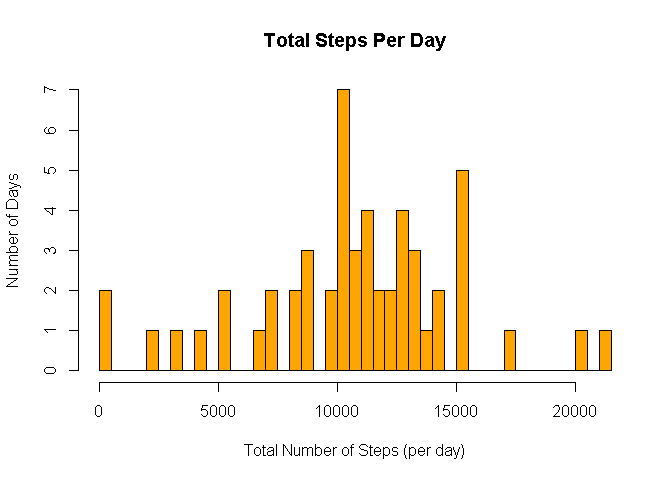
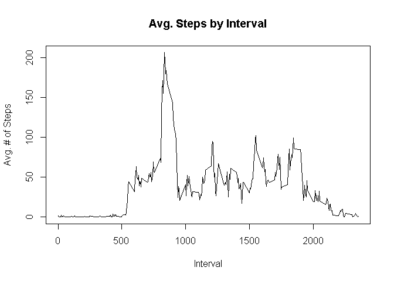
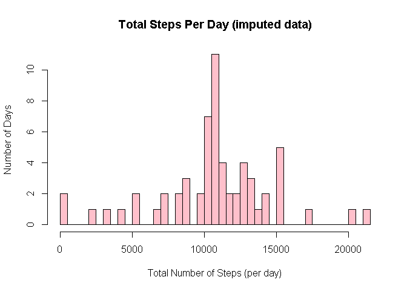
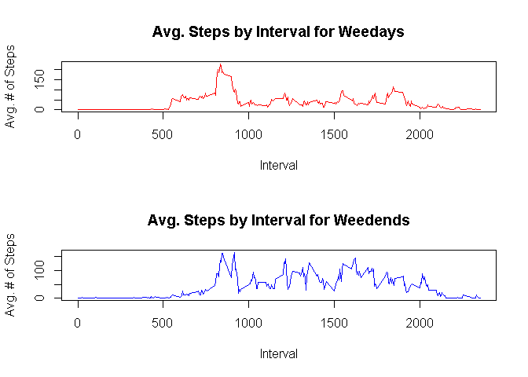

# Reproducible Research: Peer Assessment 1


## Loading and preprocessing the data
* Install necessary packages

```r
packages <- c('dplyr','data.table')
for(package in packages){
  if(package %in% rownames(installed.packages()) == FALSE){
    install.packages(package)
  }
}
require("dplyr")
```

```
## Loading required package: dplyr
```

```
## 
## Attaching package: 'dplyr'
```

```
## The following objects are masked from 'package:stats':
## 
##     filter, lag
```

```
## The following objects are masked from 'package:base':
## 
##     intersect, setdiff, setequal, union
```

```r
require('data.table')
```

```
## Loading required package: data.table
```

```
## 
## Attaching package: 'data.table'
```

```
## The following objects are masked from 'package:dplyr':
## 
##     between, last
```

* Download file if necessary:

```r
if(!file.exists('activity.zip')){
  URL <- "https://d396qusza40orc.cloudfront.net/repdata%2Fdata%2Factivity.zip"
  download.file(URL,"activity.zip")
}
```

* Extract file:

```r
unzip('activity.zip')
```

* Load data and convert date column to character format:

```r
activity <- read.csv('activity.csv', colClasses = c("date" = "character"))
```

* Convert dates from character to Date format:

```r
activity[[2]] <- as.Date(activity[[2]], "%Y-%m-%e")
```


## What is mean total number of steps taken per day?
* Create data frame with NAs removed:

```r
activity_no_na <- activity[complete.cases(activity),]
```

* Group data by date:
* Select desired columns:
* Create summary table with sum for each variable within a group:

```r
activity_small <- select(activity_no_na, date, steps)
grouped_data <- group_by_(activity_small, .dots=c("date"))
summed_data <- summarise_each(grouped_data,funs(sum))
dates <- unique(grouped_data$date)
```

1. Make a historgram of the total number of steps taken each day.

```r
par(bg = "transparent")
hist(summed_data$steps,
     col = "orange", 
     breaks = 53,
     main = "Total Steps Per Day",
     xlab = "Total Number of Steps (per day)",
     ylab = "Number of Days"
     )
```

\

2. Calculate and report the median and mean total number of steps taken per day.

```r
tidy_data <- summarise_each(summed_data,funs(mean, median))
mean_steps <- tidy_data$steps_mean
median_steps <- tidy_data$steps_median
paste("Mean # of steps taken per day = ",mean_steps)
```

```
## [1] "Mean # of steps taken per day =  10766.1886792453"
```

```r
paste("Median # of steps taken per day = ",median_steps)
```

```
## [1] "Median # of steps taken per day =  10765"
```


## What is the average daily activity pattern?
1. Make a time series plot (i.e. type = "l") of the 5-minute interval (x-axis) and the average number of steps taken, averaged across all days (y-axis).
* Group data by interval and compute the average # of steps for each interval:

```r
intervals <- group_by_(activity_no_na, .dots=c("interval"))
avg_steps_interval <- summarise_each(intervals,funs(mean))
```

* Create line plot:

```r
plot(unique(intervals$interval), 
     avg_steps_interval$steps, 
     type = "l",
     main = "Avg. Steps by Interval",
     xlab = "Interval",
     ylab = "Avg. # of Steps"
     )
```

\

2. Which 5-minute interval, on average across all the days in the dataset, contains the maximum number of steps?
* Select row with maximum step average:
* Print interval with highest average steps:

```r
max_avg_interval <- avg_steps_interval[
  which(avg_steps_interval$steps == max(avg_steps_interval$steps)),
  ]
paste("Interval, on average across all the days, with the maximum # of step = ", 
      max_avg_interval[1])
```

```
## [1] "Interval, on average across all the days, with the maximum # of step =  835"
```


## Imputing missing values
1. Calculate and report the total number of missing values in the dataset (i.e. the total number of rows with NAs)
* complete.cases selects only rows with no NAs.
* !complete.cases selects rows with at least 1 NA.
* The number of rows in this the "missing_values" is the number of rows with at least one NA.

```r
missing_values <- activity[!complete.cases(activity),]
total_missing_values <- length(missing_values[[1]])
paste("Total # of rows with missing values = ",total_missing_values)
```

```
## [1] "Total # of rows with missing values =  2304"
```

2. Devise a strategy for filling in all of the missing values in the dataset. The strategy does not need to be sophisticated. For example, you could use the mean/median for that day, or the mean for that 5-minute interval, etc.
*Fill in missing values with mean for that interval across all days:

```r
activity_imputed <- activity
for(row in 1:nrow(activity_imputed)){
  if(is.na(activity_imputed$steps[row])){
    activity_imputed$steps[row] <- avg_steps_interval$steps[avg_steps_interval$interval 
                                                       == activity_imputed$interval[row]]
  }
}
```

3. Create a new dataset that is equal to the original dataset but with the missing data filled in.
* *See previous code chunk.*


4. Make a histogram of the total number of steps taken each day and Calculate and report the mean and median total number of steps taken per day. 


```r
grouped_imputed_data <- group_by_(activity_imputed, .dots=c("date"))
summed_imputed_data <- summarise_each(grouped_imputed_data,funs(sum))
dates <- unique(grouped_imputed_data$date)
```

* Histogram of the total number of steps taken each day (with imputed values).

```r
par(bg = "transparent")
hist(summed_imputed_data$steps,
     col = "pink", 
     breaks = 53,
     main = "Total Steps Per Day (imputed data)",
     xlab = "Total Number of Steps (per day)",
     ylab = "Number of Days"
)
```

\

* Do these values differ from the estimates from the first part of the assignment?
* What is the impact of imputing missing data on the estimates of the total daily number of steps?


```r
tidy_imputed_data <- summarise_each(summed_imputed_data,funs(mean, median))
mean_imputed_steps <- tidy_imputed_data$steps_mean
median_imputed_steps <- tidy_imputed_data$steps_median
paste("Mean # of steps taken per day = ",mean_imputed_steps)
```

```
## [1] "Mean # of steps taken per day =  10766.1886792453"
```

```r
paste("Median # of steps taken per day = ",median_imputed_steps)
```

```
## [1] "Median # of steps taken per day =  10766.1886792453"
```

* The mean and median are identicle when imputing values in this manner.  
* The imputed mean and median are identicle to the pre-imputed mean and higher than the pre-imputed median.


## Are there differences in activity patterns between weekdays and weekends?
1. Create a new factor variable in the dataset with two levels - "weekday" and "weekend" indicating whether a given date is a weekday or weekend day.


```r
activity_week <- activity_imputed
activity_week$week <- factor(weekdays(activity_week$date))
levels(activity_week$week)[levels(activity_week$week) == "Sunday"] <- "Weekend"
levels(activity_week$week)[levels(activity_week$week) == "Monday"] <- "Weekday"
levels(activity_week$week)[levels(activity_week$week) == "Tuesday"] <- "Weekday"
levels(activity_week$week)[levels(activity_week$week) == "Wednesday"] <- "Weekday"
levels(activity_week$week)[levels(activity_week$week) == "Thursday"] <- "Weekday"
levels(activity_week$week)[levels(activity_week$week) == "Friday"] <- "Weekday"
levels(activity_week$week)[levels(activity_week$week) == "Saturday"] <- "Weekend"
```

2. Make a panel plot containing a time series plot (i.e. type = "l") of the 5-minute interval (x-axis) and the average number of steps taken, averaged across all weekday days or weekend days (y-axis).
*Group data by interval and compute the average # of steps for each interval:

```r
weekend_activity <- activity_week[activity_week$week == "Weekend",c("steps","date","interval")]
intervals_weekend <- group_by_(weekend_activity, .dots=c("interval"))
avg_steps_interval_weekend <- summarise_each(intervals_weekend,funs(mean))

weekday_activity <- activity_week[activity_week$week == "Weekday",c("steps","date","interval")]
intervals_weekday <- group_by_(weekday_activity, .dots=c("interval"))
avg_steps_interval_weekday <- summarise_each(intervals_weekday,funs(mean))
```

* Create panel plot:

```r
par(mfrow = c(2,1), bg = "transparent")

plot(unique(intervals_weekday$interval), 
     avg_steps_interval_weekday$steps, 
     type = "l",
     main = "Avg. Steps by Interval for Weedays",
     xlab = "Interval",
     ylab = "Avg. # of Steps",
     col = "red"
)
plot(unique(intervals_weekend$interval), 
     avg_steps_interval_weekend$steps, 
     type = "l",
     main = "Avg. Steps by Interval for Weedends",
     xlab = "Interval",
     ylab = "Avg. # of Steps",
     col = "blue"
)
```

\


